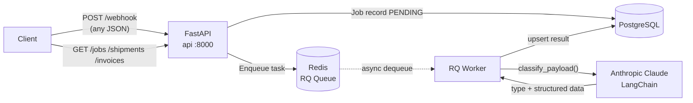
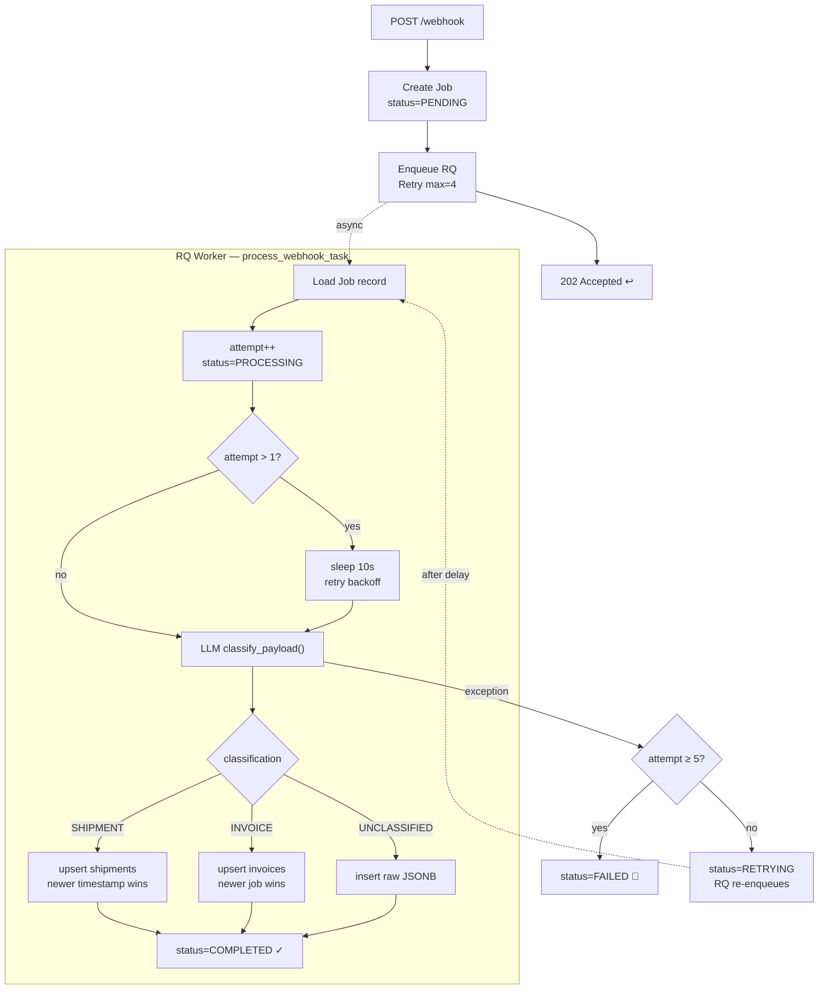

# Scalable Webhook Processor

A service that accepts any incoming JSON webhook, hands it to **Anthropic Claude** for classification, and durably persists the result to PostgreSQL — all without blocking the caller. The API acknowledges every request in milliseconds; the heavy lifting happens asynchronously in a Redis-backed worker.

## Demo

▶️ [Watch the demo on Loom](https://www.loom.com/share/5565858fc50c48da9567f13ecb94d3de)

## What it does

When a webhook arrives at `POST /webhook`, the API immediately creates a job record and pushes the payload onto a Redis queue, returning `202 Accepted`. A background RQ worker picks it up, asks Claude to decide whether the payload is a **Shipment update**, an **Invoice**, or something **Unclassified**, then upserts the result into the appropriate table. If the worker encounters an error it retries up to five times before marking the job as permanently failed. Every job — pending, processing, completed, or failed — is visible through the `/jobs` API.

## High-Level Design



## Low-Level Design — Task Flow



The 10-second backoff only applies on retries, not on the first attempt. Duplicate shipments are resolved by event timestamp; duplicate invoices are resolved by which job arrived most recently.

## LLM Prompting Strategy

The system prompt tells Claude there are three payload types (Shipment, Invoice, Unclassified), describes each type's required fields and acceptable values, and instructs it to normalise field names regardless of casing. The response is bound to a `ClassificationResult` Pydantic schema using `with_structured_output()` — this converts the schema into a tool definition so Claude sees each field's type and description directly, constraining it to only return valid values. If the declared `type` doesn't match the populated sub-object, the task raises and retries.

## Production Considerations

**Worker scaling** — Replace RQ with Celery backed by a broker like RabbitMQ or SQS. Celery's distributed model lets you run many cheap spot instances as workers and scale them independently from the API, which cuts cost significantly under variable load.

**Database** — Enable automated backups and consider splitting invoices and shipments into separate databases so each can be scaled, replicated, or sharded based on its own traffic pattern. Unclassified events are rarely queried by the application; if they only need to be audited, storing them in S3 (or any object store) is far cheaper than keeping them in Postgres.

**Message queue** — Redis/RQ works well up to a certain throughput ceiling. For a system ingesting very high volumes of webhooks, replacing Redis with Kafka gives you durable log retention, replay, and horizontal partition-based scaling out of the box.

**LLM resilience** — Routing requests across multiple providers (e.g. Anthropic primary, OpenAI fallback) handles rate limits, outages, and credit exhaustion automatically. Different payload types could also be routed to whichever model is cheapest or fastest for that kind of content.

**API security** — All endpoints should sit behind an auth middleware before going to production. JWT bearer tokens or API key validation added as a FastAPI dependency covers most use cases, and a rate-limiter in front of `/webhook` prevents abuse from noisy senders.

## Running Locally

You need Docker and Python 3.12 or newer.

```bash
git clone <repo-url> && cd scalable-webhooks

cp .env.example .env
# open .env and set ANTHROPIC_API_KEY=sk-ant-...

./run_local.sh
```

The script starts the Docker infrastructure, creates a virtualenv, installs dependencies, runs Alembic migrations, starts the RQ worker in the background, then launches Uvicorn with hot-reload. The API is at **http://localhost:8000/docs**.

If port 5432 is already taken by a local Postgres instance, add `POSTGRES_PORT=5433` to your `.env`.

## Generating Test Payloads

`test_gen.py` uses the same Claude model to generate realistic, varied payloads. It only prints — it does not send anything.

```bash
./run_local.sh --test                       # random type each run
./run_local.sh --test --shipment            # shipment payloads
./run_local.sh --test --invoice --count 3   # three invoice payloads
./run_local.sh --test --unclassified
```

## API Reference

| Method | Path | Description |
|---|---|---|
| `POST` | `/webhook` | Submit any JSON payload |
| `GET` | `/jobs` | List all jobs — filter by `status` or `classification` |
| `GET` | `/jobs/{task_id}` | Job detail with resolved entity attached |
| `GET` | `/shipments` | List shipments — filter by `vendor_id` or `status` |
| `GET` | `/shipments/{tracking_number}` | Single shipment |
| `GET` | `/invoices` | List invoices — filter by `vendor_id` or `currency` |
| `GET` | `/invoices/{vendor_id}/{invoice_id}` | Single invoice |
| `GET` | `/unclassified` | List unclassified events |
| `GET` | `/health` | Redis connectivity check |

## Directory Overview

```
app/
  api/routes/        route handlers for every endpoint above
  db/
    database.py      async engine for the API, sync engine for the worker
    models/          Job, Shipment, Invoice, UnclassifiedEvent ORM models
  services/
    llm.py           LangChain + Anthropic classifier with structured output
    redis_client.py  RQ queue factory
  worker/
    tasks.py         core job processing logic with retry and upsert
    listener.py      worker entry-point (SimpleWorker on macOS, Worker on Linux)
  schemas/job.py     Pydantic response models
  config.py          all environment variables via pydantic-settings

migrations/          Alembic migration scripts
docker-compose.yml   full stack
docker-compose.infra.yml  infra only (postgres + redis)
run_local.sh         local dev entry-point
test_gen.py          LLM-powered payload generator
```
